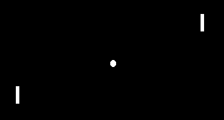
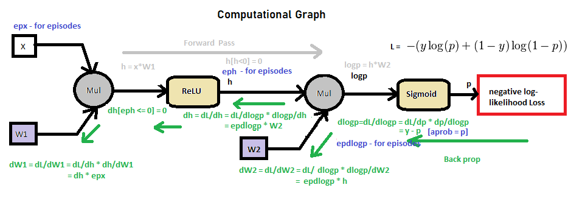
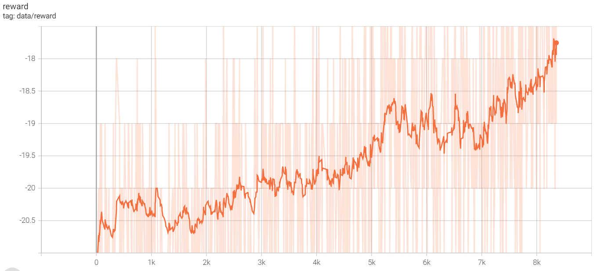

# Hello Policy Gradient

This module is an implementation of a very comprehensive implementation of Policy-Gradient Method, to be specific, the REINFORCE method to train an agent on Atari Pong game.

The code here is based on a nice script from [karpathy](https://gist.github.com/karpathy/a4166c7fe253700972fcbc77e4ea32c5). But I modularize them into a tidy manner and add many informative comments and explanations in the code. And there're also a computational graph from github forum to clarify the backward propagation of REINFORCE. You can refer to this when you dive into the code:

Moreover, I also add tensorboardx to visualize the training process, here is an example of the training result after 8k epochs:

I hope you guys can have fun with it.
